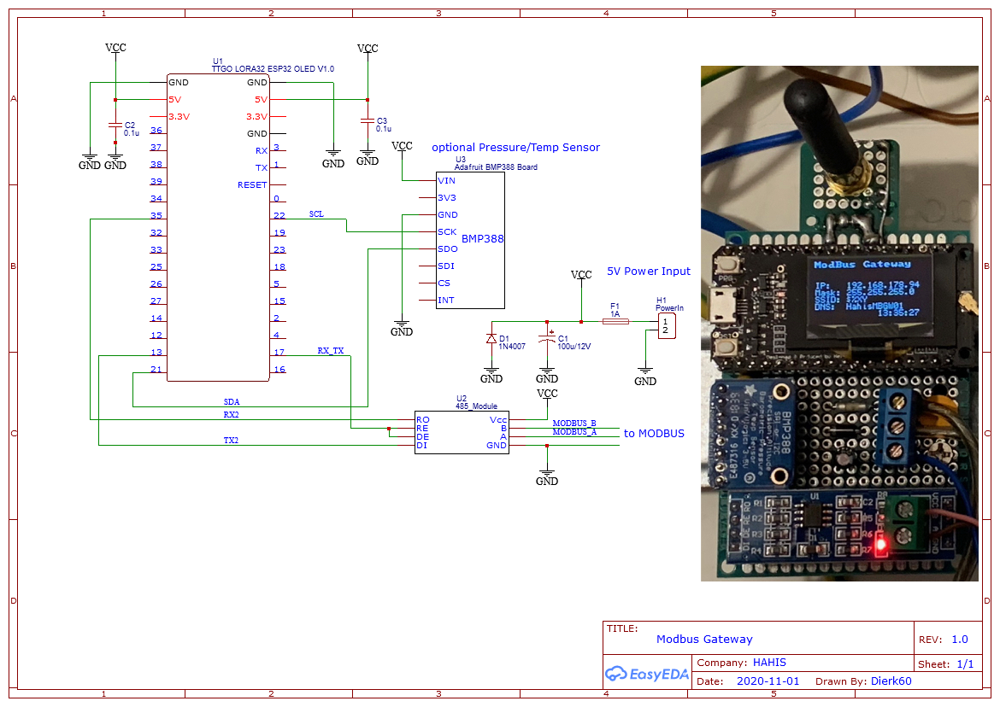
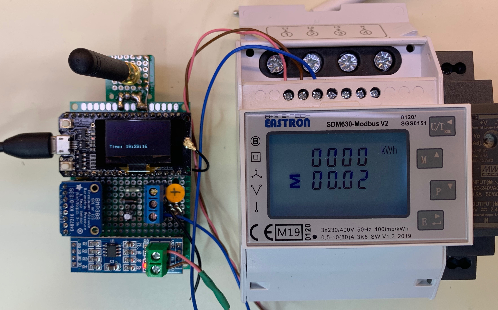
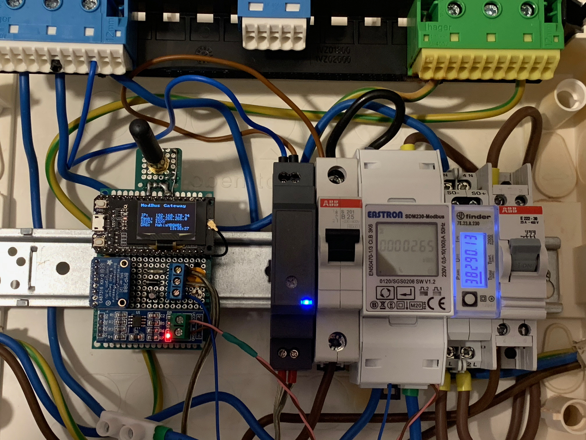

# esp32ModbusGateway
 ModBus Gateway with Wifi and LORA Support

## Use case

Intention of this project is to connect ModBus power meters to "usable" modern interfaces.
- Rest API / JSON
- Lora Client (The Things Network)

## Hardware

**Supported ESP32 based boards**:

*LoRa & SPI*:
- TTGO: T1*, T2*, T3*, T-Beam, T-Fox

**Supported / Tested ModBus meters**:
- SDM630
- SDM230
- FINDER

## TODO

- HTTP Server Code not finish.  jQuery from SPIFF
- Deap Sleep options for shut down during night time
- store settings in SPIFFS
- finish Lora tx

## JSON API description

The ModBusGateway uses a json API to communicate with a backend.

### Actions

  - `/api/meter` power meter data (`GET`)
    ```
    {
      "connected":true,       // modbus connected
      "frequency":49.95122,   // line frequency in Hz
      "energy_out":0.01,      // exported Energy in kWh
      "energy_in":10.007,     // imported Engery in kWh
      "u_1":223.8788,         // phase1: voltage in V
      "i_1":0.56999,          // phase1: current in A
      "p_1":90.2756,          // phase1: power in W
      "ap_1":116.3189,        // phase1: apparent power in VA
      "rp_1":73.34446,        // phase1: reactive power in VAr
      "u_2":0,                // phase2: voltage in V               
      "i_2":0,                // phase2: current in A
      "p_2":0,                // phase2: power in W
      "ap_2":0,               // phase2: apparent power in VA
      "rp_2":0,               // phase2: reactive power in VAr
      "u_3":0,                // phase3: voltage in V
      "i_3":0,                // phase3: current in A
      "p_3":0,                // phase3: power in W
      "ap_3":0,               // phase3: apparent power in VA
      "rp_3":0,               // phase3: reactive power in VAr
      "cycles":10524,         // number of Modbus cycles
      "ErrCnt":0              // Modbus Error count
    }
    ```

  - `/api/status` system health (`GET`)
  - `/api/wlan` set WiFi configuration (`GET`)
  - `/api/restart` restart (`POST`)
  - `/api/settings` save settings (restarts) (`POST`)


## TTN Payload format

- ***Plain*** uses big endian format and generates json fields, e.g. useful for TTN console

- ***Packed*** uses little endian format and generates json fields

Hereafter described is the default *plain* format, which uses MSB bit numbering. Under /TTN in this repository you find some ready-to-go decoders which you may copy to your TTN console:

[**plain_decoder.js**](src/TTN/plain_decoder.js) | 
[**plain_converter.js**](src/TTN/plain_converter.js) |

**Port #1:** basic PowerMeter data

	byte 1-4:	(float): Energy In      [kWh]
    byte 5-8:   (float): Energy Out     [kWh]
    byte 9-12:  (float): current Power  [kW]

**Port #2:** Device status query result

  	byte 1-2:	Battery or USB Voltage [mV], 0 if no battery probe
	byte 3-10:	Uptime [seconds]
	byte 11: 	CPU temperature [°C]
	bytes 12-15:	Free RAM [bytes]
	bytes 16-17:	Last CPU reset reason [core 0, core 1]

**Port #7:** Environmental sensor data (only if device has feature BME)

	bytes 1-2:	Temperature [°C]
	bytes 3-4:	Pressure [hPa]
	bytes 5-6:	Humidity [%]
	bytes 7-8:	Indoor air quality index (0..500), see below

	Indoor air quality classification:
	0-50		good
	51-100		average
	101-150 	little bad
	151-200 	bad
	201-300 	worse
	301-500 	very bad

**Port #9:** Time/Date

  	bytes 1-4:	board's local time/date in UNIX epoch (number of seconds that have elapsed since January 1, 1970 (midnight UTC/GMT), not counting leap seconds) 


# Remote control

The device listenes for remote control commands on LoRaWAN Port 2. Multiple commands per downlink are possible by concatenating them.

Note: all settings are stored in NVRAM and will be reloaded when device starts.
(TODO)
	
# Schematic:



# Prototype:

Test with TTGO Lora and SDM 610


In Action with SDM230:



