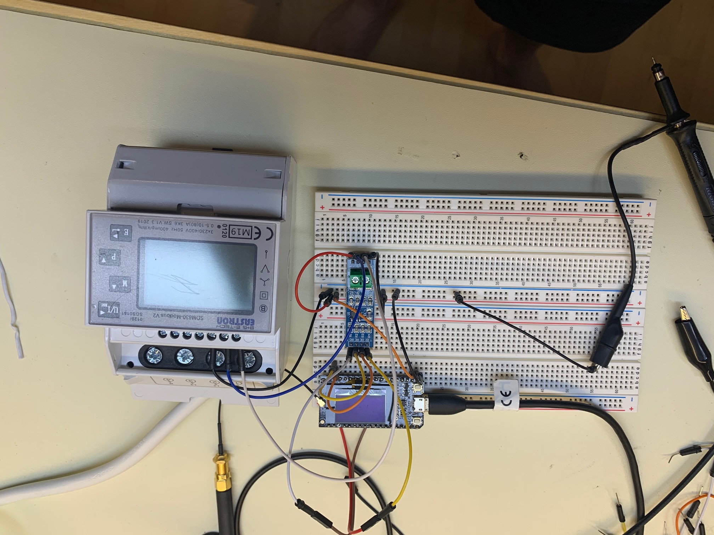

# esp32ModbusGateway
 ModBus Gateway with Wifi and LORA Support

# Use case

Intention of this project is to connect "old" ModBus electrical meters to usable interfaces.
- Rest API / JSON
- Lora Client (The Things Network)

## JSON API description

The ModBusGateway uses a json API to communicate with a backend.

### Actions

  - `/api/meter` power meter data (`GET`)
    ```
    {
        "connected":true,
        "voltage":75.65258,
        "current":0,
        "power":0,
        "reactive_power":0,
        "frequency":49.89715,
        "energyout":0.02,
        "energyin":0,
        "u_phase_1":226.9928,
        "i_phase_1":0,
        "u_phase_2":0,
        "i_phase_2":0,
        "u_phase_3":0,
        "i_phase_3":0,
        "cycles":186,
        "ErrCnt":0
    }
    ```

  - `/api/status` system health (`GET`)
  - `/api/wlan` set WiFi configuration (`GET`)
  - `/api/restart` restart (`POST`)
  - `/api/settings` save settings (restarts) (`POST`)

## TTN functions

The ModBusGateway uses a json API to communicate with a backend.

### Actions


# Prototype 1:

Test Board with TTGO Lora and SDM 610


Modbus Reply:


# Hardware

**Supported ESP32 based boards**:

*LoRa & SPI*:
- TTGO: T1*, T2*, T3*, T-Beam, T-Fox


